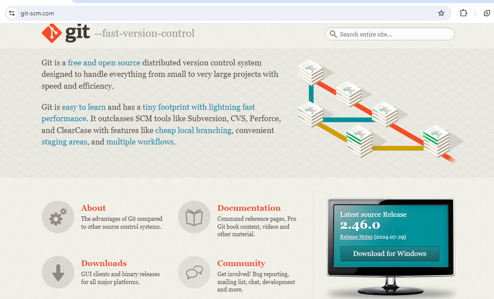

# Instalasi Git Bash
1. Jika Aplikasi Git Bash belum ada di laptop kalian, maka kalian bisa menginstal aplikasi Git Bash di google dengan mengetik `Git scm` atau bisa klik link ini : https://git-scm.com/


2. Setelah itu klik Git Hub yang telah di instal, kalian klik tombol next saja sampai terlihat tampilan Installing1. 
# Membuat Repository 
1. Jika kita ingin membuat repository baru di git hub caranya adalah...
Klik tanda tambah yang di berada di kanan atas, lalu klik `New repository` 
![[assets/repository.png|200]]

2. Setelah itu tambahkan nama repository yang kita inginkan contoh : `belajar-git` 
![[assets/repository1.png|600]]

3. Lalu klik `Create repository` 
![[assets/repository3.png|590]]

4. Setelah repository berhasil dibuat maka tampilannya akan seperti ini
![[assets/repository4.png|650]]


# Konfigurasi Awal di Git Bash
1. Menampilkan Konfigurasin Git
code : 
```bash
git config --list
```
![[assets/konfigurasi_git.png|500]]

2. Tambahkan username dan email pada GIt Bash
code : 
```bash
git config --global user.name "username"
```
```bash
git config --global user.email "email"
```
![[assets/konfigurasi_1.png|500]]

3. setelah itu cek apabila berhasil di masukkan
code : 
```bash
git config --list
```
![[assets/konfigurasi2.png|500]]

# Akses Folder Proyek pada Git Bash
1. Buat folder baru dalam folder obsidian
![[assets/akses_file_git.png|400]]

2. Setelah itu buatkan file baru di obsidian
![[assets/menghubungkanFolder_keGit.png|500]]

3. Lalu kita akses folder tersebut pada Git Bash dengan mengetik `cd [nama_folder_yang_disimpan` seperti contoh dibawah
![[assets/cd_Obsidian.png|350]]

# Menghubungkan Folder Lokal ke Github
## Git init dan Git remote add origin
- `git init` adalah langkah awal dalam membuat repository Git baru, menyediakan struktur dan sistem version control untuk proyek.
- `Git remoote add origin` menghubungkan repositorylokal dengan remote repository, memungkinkan kolaborasi dan sinkronisasi antara berbagai lokasi. 
kode : Git init
```bash
git init
```
kode : Git remote add origin
```bash
git remote add origin <URL>
```

![[assets/gitInit_remote.png]]

## Tampilkan status commit / koneksi file ke git
Perintah `git commit -m` dalam Git digunakan untuk menyimpan perubahan yang telah kita tambahkan ke area staging ke dalam riwayat commit dengan menyertakan pesan deskriptif.
kode : 
```bash
git commit -m "belajar awal"
```
![[assets/Git_commit.png|500]]

## Git add 
Perintah `git add` digunakan dalam git untuk menambahkan perubahan ke area staging, yang merupakan langkah penting sebelum melakukan commit. 
kode : 
```bash
git add .
```
![[assets/git_add.png|650]]

## Git Push Origin Master
Perintah `git push origin master` digunakan dalam sistem kontrol versi Git untuk mengirimkan perubahan dari cabang lokal `master` ke repositori remote yang bernama `origin`.
kode : 
```bash 
git push origin master
```
![[assets/git_pushOrigin_master.png|590]]

- Setelah itu maka akan langsung otomatis gambar seperti di bawah ini
![[assets/sign_GitHub.png|290]]

- Klik "Sign in with your browser" dan masukkan username/email dan password Git Hub kalian
![[assets/GitHub_sign_in.png|200]]

- Lalu akan muncul pilihan "cancel" atau "Authorize git-ecosystem", kalian pilih yang "Authorize git-ecosystem" maka tampilannya akan seperti gambar di bawah ini : 
![[assets/sign_in_succes.png|490]]
