# Instalasi Git Bash
1. Jika Aplikasi Git Bash belum ada di laptop kalian, maka kalian bisa menginstal aplikasi Git Bash di google dengan mengetik `Git scm` atau bisa klik link ini : https://git-scm.com/


2. Setelah itu klik Git Hub yang telah di instal, kalian klik tombol next saja sampai terlihat tampilan Installing1. 
# Membuat Repository 
1. Jika kita ingin membuat repository baru di git hub caranya adalah...
Klik tanda tambah yang di berada di kanan atas, lalu klik `New repository` 
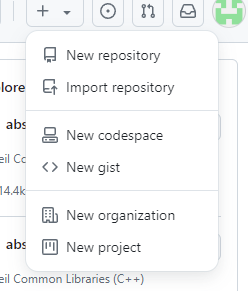

2. Setelah itu tambahkan nama repository yang kita inginkan contoh : `belajar-git` 
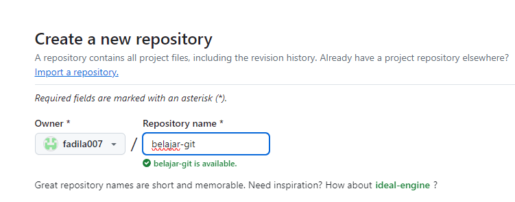

3. Klik tanda `public` agar repository kita bisa di lihat oleh orang lain
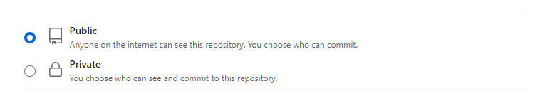

4. . Lalu klik `Create repository` 
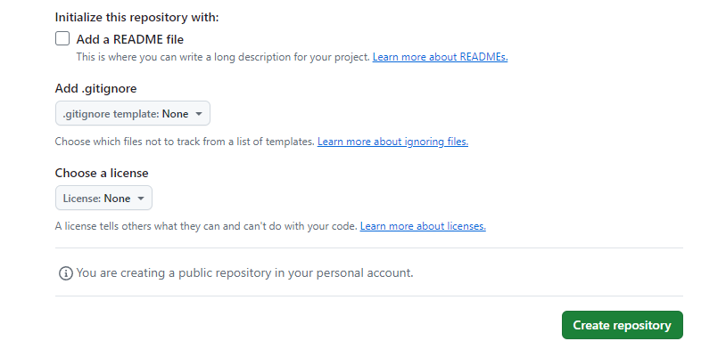

5. Repository yang berhasil di buat akan tertampil seperti gambar di bawah
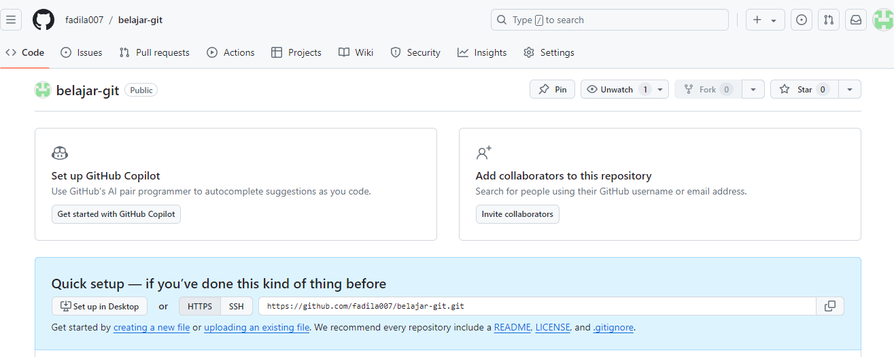


# Konfigurasi Awal di Git Bash
1. Menampilkan Konfigurasin Git
code : 
```bash
git config --list
```
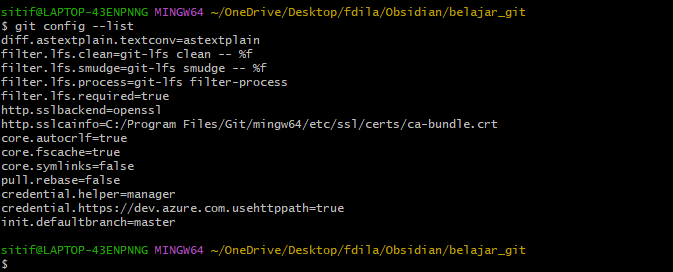

2. SEtelah itu tambahkan username dan email pada GIt Bash

code : 
```bash
git config --global user.name "username"
```
```bash
git config --global user.email "email"
```
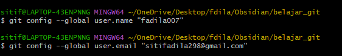

3. setelah itu cek apabila berhasil di masukkan dengan mengetikkan code di bawah
code : 
```bash
git config --list
```
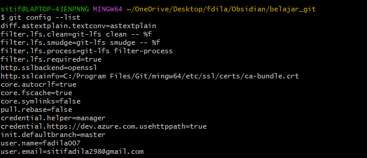

# Akses Folder Proyek pada Git Bash

Untuk cara mengakses folder Obsidian ke Git Bash, caranya sebagai berikut :

1. Buat folder baru dalam folder obsidian
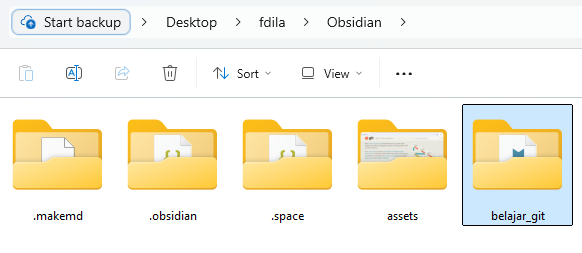

2. Setelah itu buatkan file didalam folder belajar_git
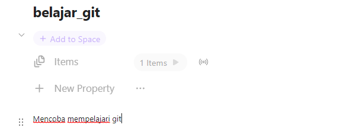

3. Setelah itu kita akses folder tersebut ke git bash dengan mengetik kode di bawah
Kode
```bash
cd [nama_folder]
```

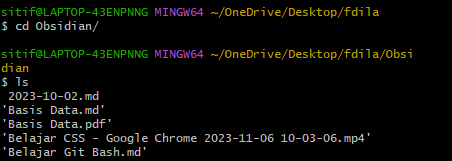

# Menghubungkan Folder Lokal ke Github
## Git init dan Git remote add origin
- `git init` adalah langkah awal dalam membuat repository Git baru, menyediakan struktur dan sistem version control untuk proyek.
- `Git remoote add origin` menghubungkan repositorylokal dengan remote repository, memungkinkan kolaborasi dan sinkronisasi antara berbagai lokasi. 
kode : Git init
```bash
git init
```
kode : Git remote add origin
```bash
git remote add origin <URL>
```

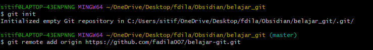

## Tampilkan status commit / koneksi file ke git
Perintah `git commit -m` dalam Git digunakan untuk menyimpan perubahan yang telah kita tambahkan ke area staging ke dalam riwayat commit dengan menyertakan pesan deskriptif.

kode : 
```bash
git commit -m "belajar awal"
```

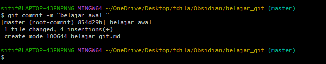
## Git add 
Perintah `git add` digunakan dalam git untuk menambahkan perubahan ke area staging, yang merupakan langkah penting sebelum melakukan commit. 

kode : 
```bash
git add .
```

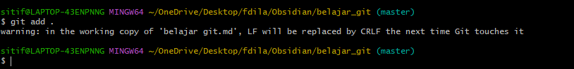

## Git Push Origin Master
Perintah `git push origin master` digunakan dalam sistem kontrol versi Git untuk mengirimkan perubahan dari cabang lokal `master` ke repositori remote yang bernama `origin`.

kode : 
```bash 
git push origin master
```

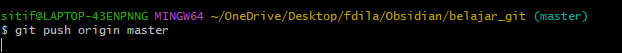

## Akses folder Git
- Setelah itu maka akan langsung otomatis gambar seperti di bawah ini

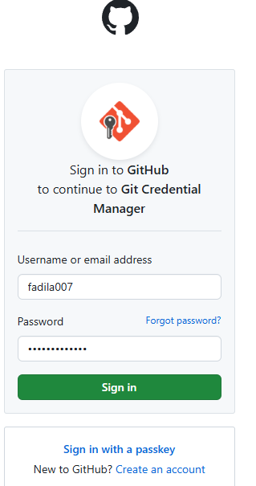

- Klik "Sign in with your browser" dan masukkan username/email dan password Git Hub kalian


- Lalu akan muncul pilihan "cancel" atau "Authorize git-ecosystem", kalian pilih yang "Authorize git-ecosystem" maka tampilannya akan seperti gambar di bawah ini : 
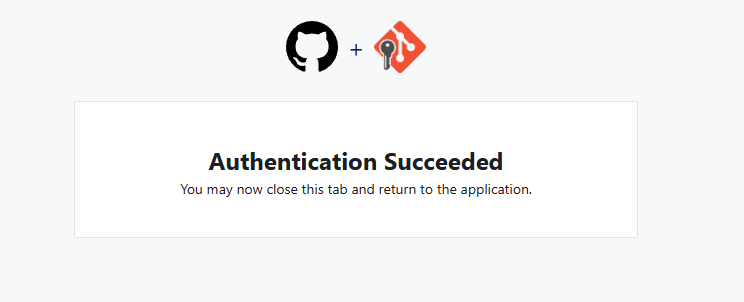
